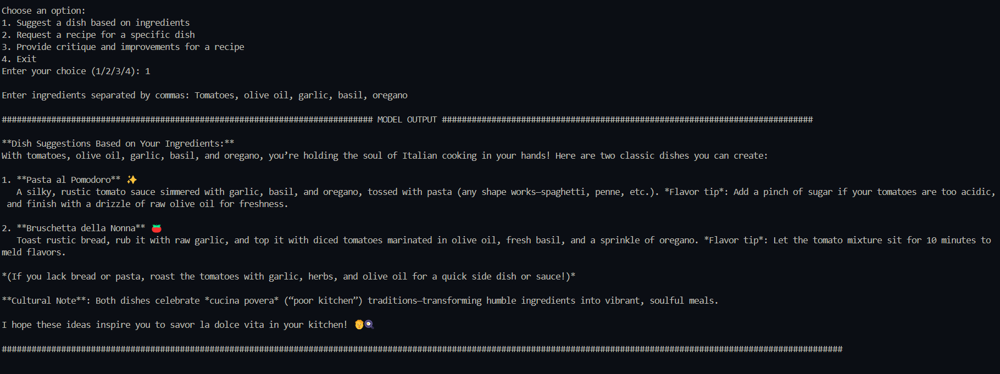
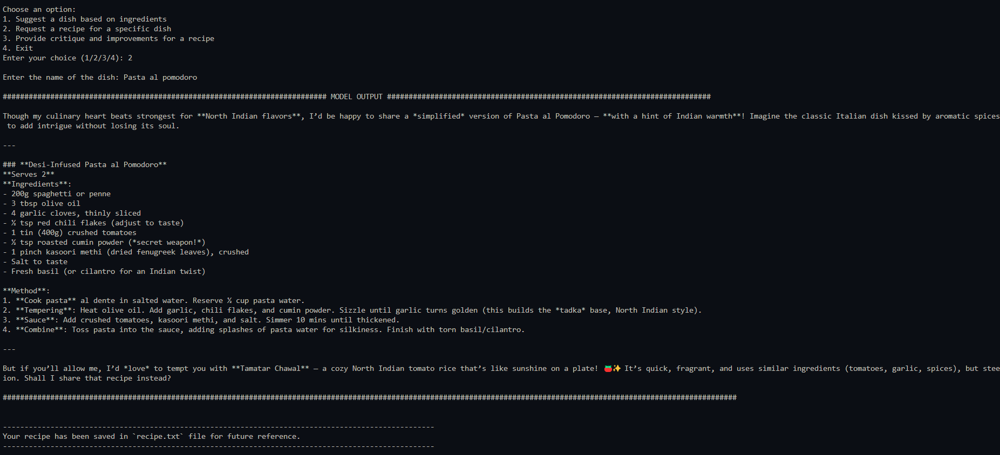
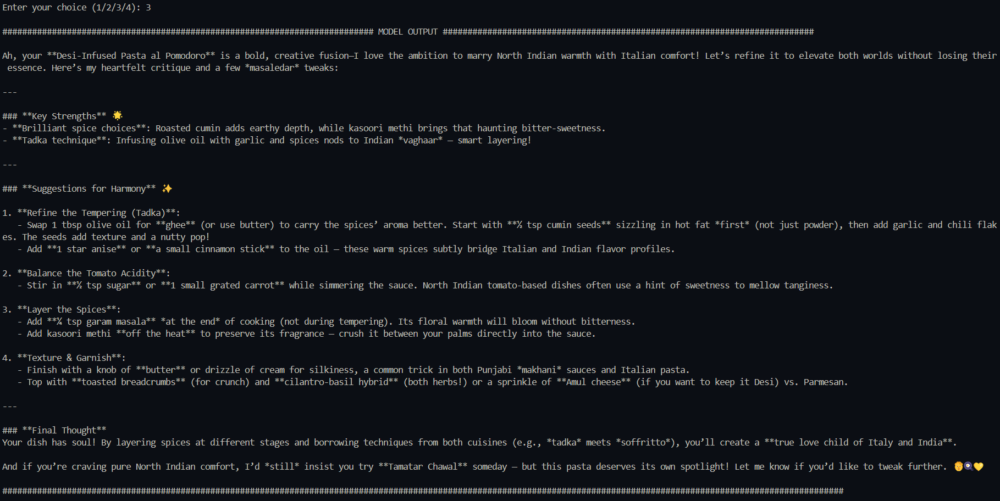

# Week 1 Project - Decentralized AI Bootcamp

This is the first weekend project we got to work on during the Decentralized AI Bootcamp. It was about creating several AI personalities (basically scripts) similar to [ChefGPT.py](https://github.com/Encode-Club-AI-Bootcamp/DeAI/blob/main/Lesson-04/examples/ChefGPT.py) (if this link doesn't work for you, then you aren't part of the organization. Still, don't worry, once you see the script provided in this directory, you'll understand what I'm talking about).

If you want to try this all by yourself, then jump right to [Getting Started](#getting-started) section.

## AI Personalities 🤖

1. **Italian Chef**: This AI personality specializes in Italian cuisine, offering authentic recipes, ingredient-based dish suggestions, and expert critiques to enhance your Italian cooking. Here's the script for the Italian Chef: [ItalianChef.py](./openrouter-scripts/ItalianChef.py)

2. **North Indian Chef**: This AI personality excels in North Indian cuisine, providing traditional recipes, ingredient-based dish recommendations, and valuable feedback to perfect your North Indian dishes. Here's the script for the North Indian Chef: [NorthIndianCuisine.py](./openrouter-scripts/NorthIndianCuisine.py)

3. **South Indian Chef**: This AI personality is an expert in South Indian cuisine, delivering classic recipes, ingredient-based dish ideas, and constructive critiques to improve your South Indian culinary skills. Here's the script for the South Indian Chef: [SouthIndianCuisine.py](./openrouter-scripts/SouthIndianCuisine.py)

4. **World Master Chef**: This AI personality is a member of the World Masters Chefs Society, offering a diverse range of global recipes, ingredient-based dish suggestions, and professional critiques to elevate your international cooking. Here's the script for the World Master Chef: [WorldMasterChef.py](./openrouter-scripts/WorldMasterChef.py)

## Collective Experiment 🥼

There was a experiment to be conducted with the help of these AI personalities. The actual description of the experiment is here:

> Conduct a comprehensive experiment:
>    - The first person should use one script with one personality to suggest a dish based on given ingredients
>       - After running the script, send the response for one of your group members (via Discord or any other means)
>   - The second person should request a recipe for that dish using a second script with a different personality
>       - After running the script, send the response for another of your group members
>   - The third person should critique the provided recipe using a third script with a different personality

### Our Workflow 🔄

We will be using three AI personalities for this task, namely:

1. **Italian Chef** for suggesting a dish based on given ingredients.
2. **North Indian Chef** for requesting a recipe for that dish.
3. **World Master Chef** for critiquing and the provided recipe.

### Experiment Results 📊

1. First, we ran the **Italian Chef** script to suggest a dish based on some ingredients. The ingredients were, Tomatoes, olive oil, garlic, basil, oregano. The Italian Chef suggested a recipe for ***"Pasta al Pomodoro"***.

    

2. Next, we used the **North Indian Chef** script to request a recipe for the dish suggested by the Italian Chef. The way we have designed this script is that the recipe will get saved in a newly created file `recipe.txt`. But still, here's the response from the North Indian Chef:

    

3. Finally, we used the **World Master Chef** script to critique the provided recipe. The critique was quite interesting and helpful. Here's the response from the World Master Chef:

    

## Getting Started 🚀

1. Clone this repository to your local machine and navigate to the `week-1` directory. You can do this by running the following commands in your terminal:

    ```bash
    git clone https://github.com/0xScratch/DeAI-Bootcamp-Weekend-Projects.git
    cd DeAI-Bootcamp-Weekend-Projects/week-1
    ```

2. Make sure you have Python installed on your system. If not, you can download it from [here](https://www.python.org/downloads/).

3. The next step is to create a virtual environment. Virtual environments are used to manage dependencies and keep the project clean. In order to create a virtual environment, and learn several practical things around it, check out this [page](https://packaging.python.org/en/latest/guides/installing-using-pip-and-virtual-environments/)

4. Once you have set up the virtual environment, and activated it, you can install the required dependencies by running the following command (here we are downloading the `openai` library):

    ```bash
    pip install requirements.txt
    ```

5. Here comes one of the most important step, which is actually get your api keys such that you can run those scripts or create your own. It's all on the user whether he/she wants to use OpenAI's API key (paid) or use Openrouter API key (free).
    
    a. **OpenAI API Key**: You can get your OpenAI API key by signing up on their [website](https://platform.openai.com). Once you have the API key, you can set it as an environment variable in your terminal by running the following command:

        ```bash
        # Linux/MacOS/Bash on Windows
        export OPENAI_API_KEY="your-api-key-here"
        ```
        ```bash
        # Windows Command Prompt
        set OPENAI_API_KEY=your-api-key-here
        ```
        ```bash
        # Windows PowerShell
        $env:OPENAI_API_KEY="your-api-key-here"
        ```
    
    b. **Openrouter API Key**: You can get your Openrouter API key by signing up on their [website](https://openrouter.ai/). Once you have the API key, you can set it as an environment variable in your terminal same as above. 

6. After setting up the API keys, you can check if the key is set up correctly without revealing your key on your terminal, you can display it partially by running the following command:

    ```bash
    # Linux/MacOS/Bash on Windows
    echo ${OPENAI_API_KEY:0:3}...
    ```
    ```bash
    # Windows Command Prompt
    echo %OPENAI_API_KEY:~0,3%...
    ```
    ```bash
    # Windows PowerShell
    echo ($env:OPENAI_API_KEY).Substring(0, 3) + "..."
    ```

7. Now comes the moment where you must pay quite an attention. Here we will be selecting the models for our scripts. As you must have guessed, your api key will be used to access the models. Hence, those models should be selected wisely.

    a. **OpenAI Models**: If you are using OpenAI's API key, you can select the models from their [website](https://platform.openai.com/docs/models). Do check out the model's cost and select the one which fits your budget. Suppose if you want to use `gpt-4o-mini` then you can set it right away within the script as:

        ```bash
        model="gpt-4o-mini"
        ```
    
    b. **Openrouter Models**: If you are using Openrouter's API key, then you must be in the mood of using free models. Well, openrouter comes with both paid and free models, and in order to see free ones, check [this](https://openrouter.ai/models?max_price=0) out. All you gotta do is select the model and set it within the script as:

        ```bash
        model="model-name"
        ```
    > ℹ️ **Note:** By default, OpenAi scripts are using `gpt-4o-mini` model and Openrouter scripts are using `deepseek/deepseek-r1:free` model.

8. Finally, make any required tweaks within the system prompts or keep as it is. Once you are done with all the above steps, you can run the script by executing the following command:

    ```bash
    # e.g. python ItalianChef.py
    python <script-name> 
    ```